# SukaJajan - Platform Kuliner Semarang

SukaJajan adalah aplikasi sistem informasi kuliner berbasis web yang digunakan untuk mencari, mengelola, memberikan ulasan, serta menyimpan kuliner favorit.

Aplikasi ini dibangun menggunakan framework CodeIgniter 4 dengan konsep MVC (Model View Controller).

---

# ERD (Entity Relationship Diagram)

Berikut merupakan rancangan database SukaJajan:

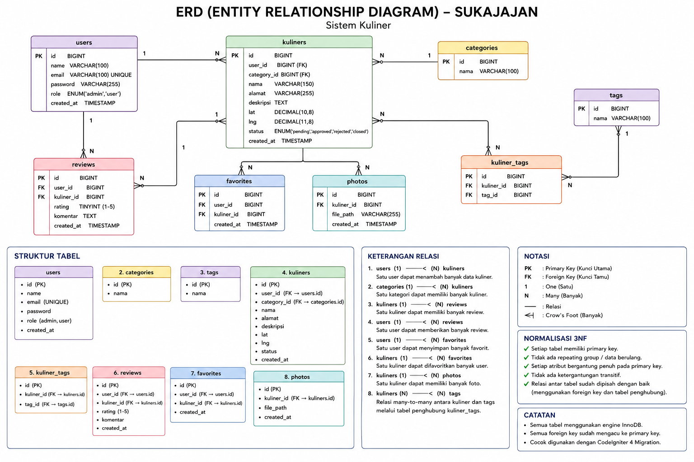

---

# Screenshot Fitur Utama

## Halaman Login

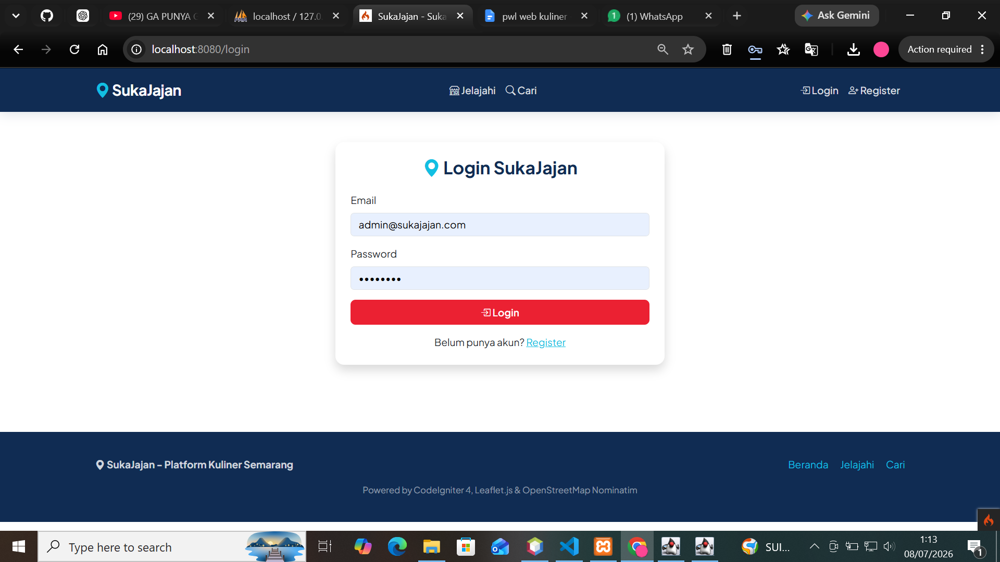

---

# Fitur User

## Dashboard User

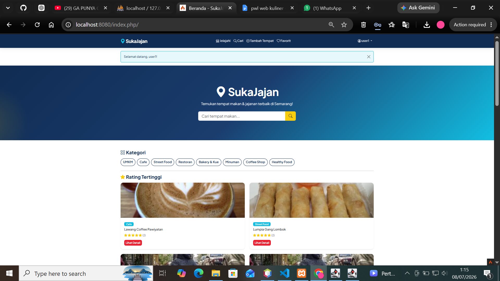


## Detail Kuliner

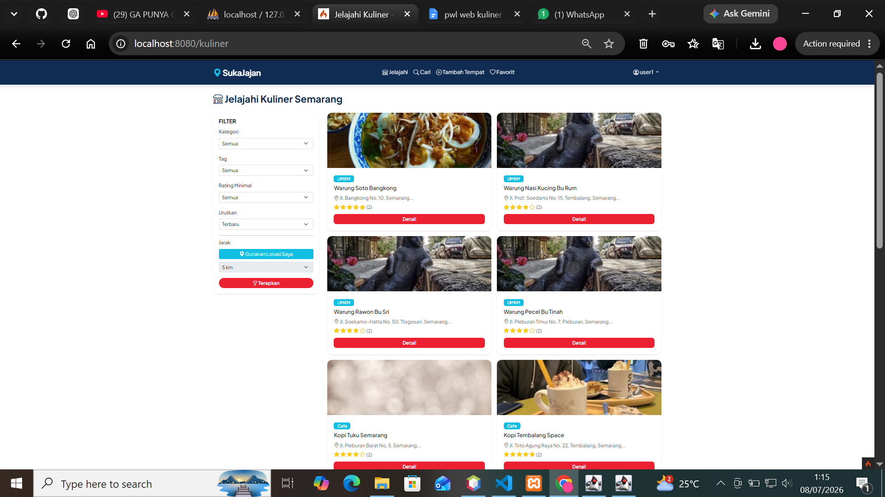


## Filter Kuliner

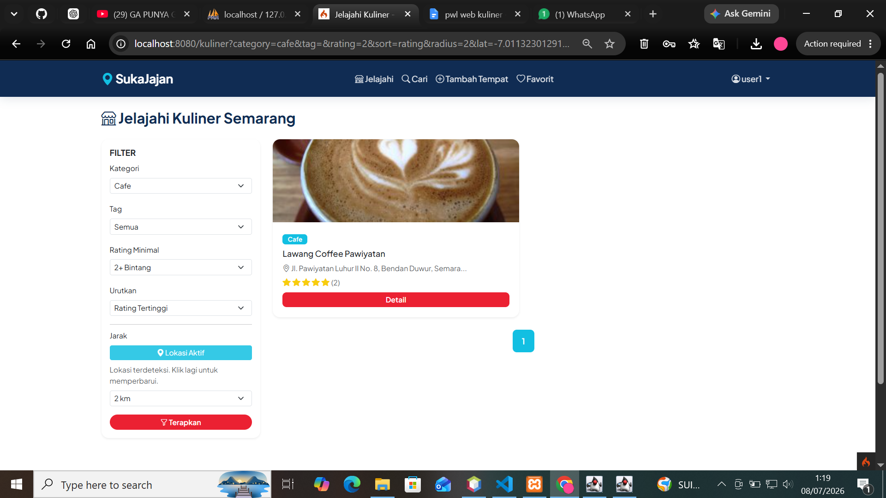


## Favorit Kuliner

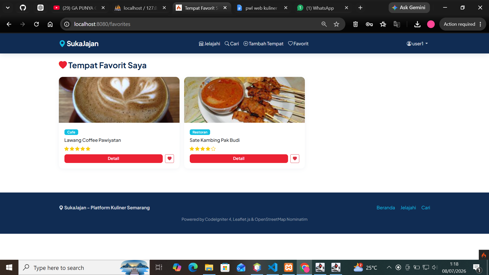


## Review Kuliner

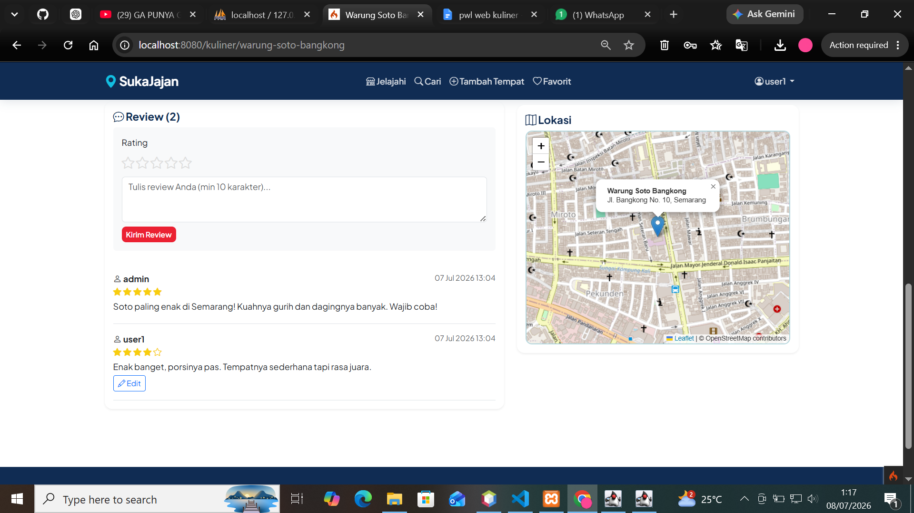

---

# Fitur Admin

## Dashboard Admin

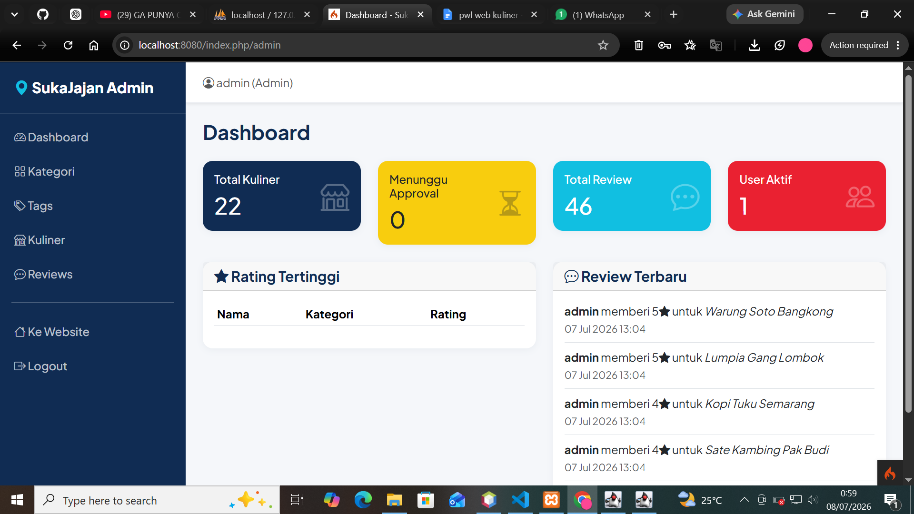


## Kelola Kategori

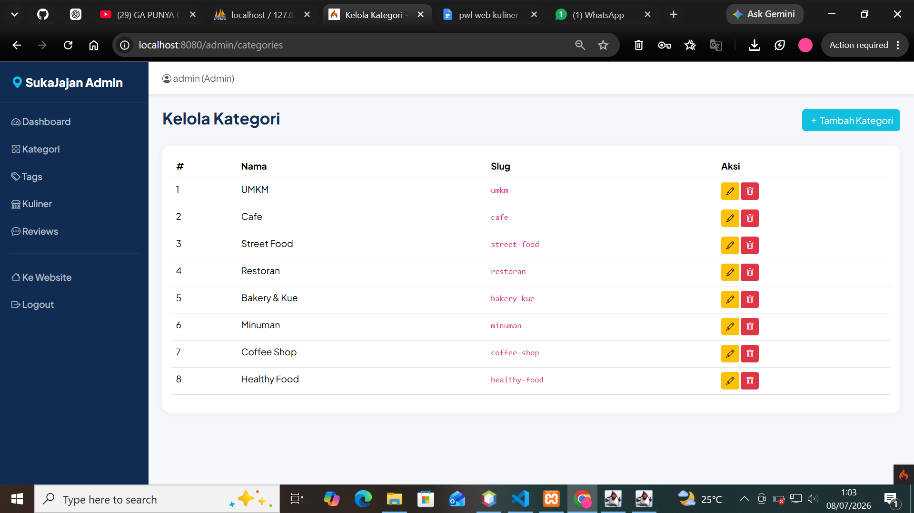


## Kelola Kuliner

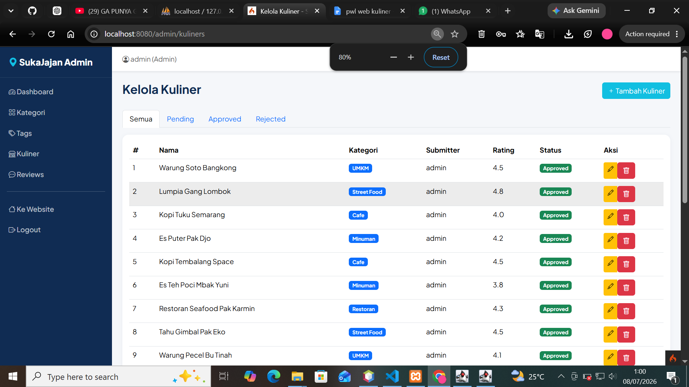


## Tambah Kuliner

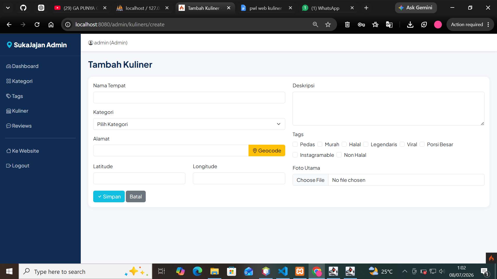


## Kelola Review

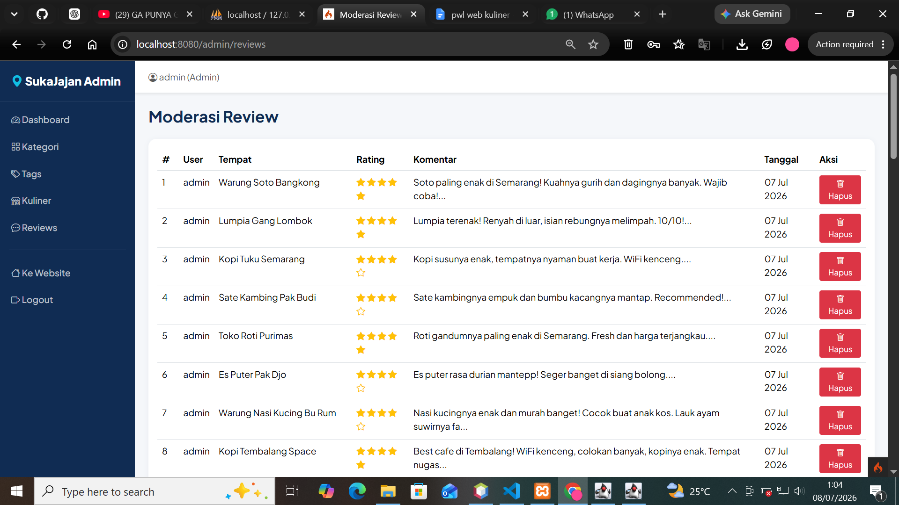

---

# Struktur Database

Database SukaJajan menggunakan normalisasi sampai Third Normal Form (3NF).

Tabel yang digunakan:

1. users
2. categories
3. kuliners
4. tags
5. kuliner_tags
6. reviews
7. favorites
8. photos

---

# Relasi Database

## 1. Users dengan Kuliners

Relasi:

users (1) ---- (N) kuliners


Keterangan:
Satu user dapat menambahkan banyak data kuliner.


## 2. Categories dengan Kuliners

Relasi:

categories (1) ---- (N) kuliners


Keterangan:
Satu kategori dapat memiliki banyak data kuliner.


## 3. Users dengan Reviews

Relasi:

users (1) ---- (N) reviews


Keterangan:
Satu user dapat memberikan banyak review.


## 4. Kuliners dengan Reviews

Relasi:

kuliners (1) ---- (N) reviews


Keterangan:
Satu kuliner dapat memiliki banyak review.


## 5. Users dengan Favorites

Relasi:

users (1) ---- (N) favorites


Keterangan:
Satu user dapat menyimpan banyak kuliner favorit.


## 6. Kuliners dengan Favorites

Relasi:

kuliners (1) ---- (N) favorites


Keterangan:
Satu kuliner dapat menjadi favorit banyak user.


## 7. Kuliners dengan Photos

Relasi:

kuliners (1) ---- (N) photos


Keterangan:
Satu kuliner dapat memiliki banyak foto.


## 8. Kuliners dengan Tags

Relasi:

kuliners (N) ---- (N) tags


Keterangan:
Relasi many-to-many antara kuliner dan tag menggunakan tabel penghubung:


kuliner_tags


---

# Normalisasi Database (3NF)

Database SukaJajan telah memenuhi Third Normal Form (3NF).

Penerapan normalisasi:

✅ Setiap tabel memiliki Primary Key.

✅ Tidak terdapat data yang mengalami duplikasi.

✅ Setiap atribut bergantung penuh terhadap Primary Key.

✅ Tidak terdapat ketergantungan transitif.

✅ Relasi Many-to-Many menggunakan tabel penghubung.

# Cara Instalasi
## Setup

-- Install Dependency dan Konfigurasi Environment
```bash
composer install
cp env .env
```

Edit `.env` — sesuaikan port database (default `3306`, MAMP pakai `8889`):

```ini
database.default.port = 3306
```

## Jalankan

```bash
mysql -u root -e "CREATE DATABASE sukajajan"
php spark migrate
php spark db:seed InitialSeeder
mkdir -p public/uploads/kuliner public/uploads/thumbnails
php spark serve
```

Buka **http://localhost:8080**

## Akun Default

| Role | Email | Password |
|------|-------|----------|
| Admin | admin@sukajajan.com | admin123 |
| User | user1@sukajajan.com | user123 |

## Reset Database

```bash
php spark migrate:rollback
php spark migrate
php spark db:seed InitialSeeder
```

# Teknologi yang Digunakan
PHP
CodeIgniter 4
MySQL
HTML
CSS
Bootstrap
JavaScript